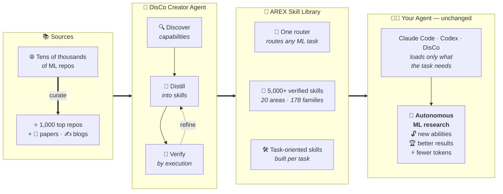
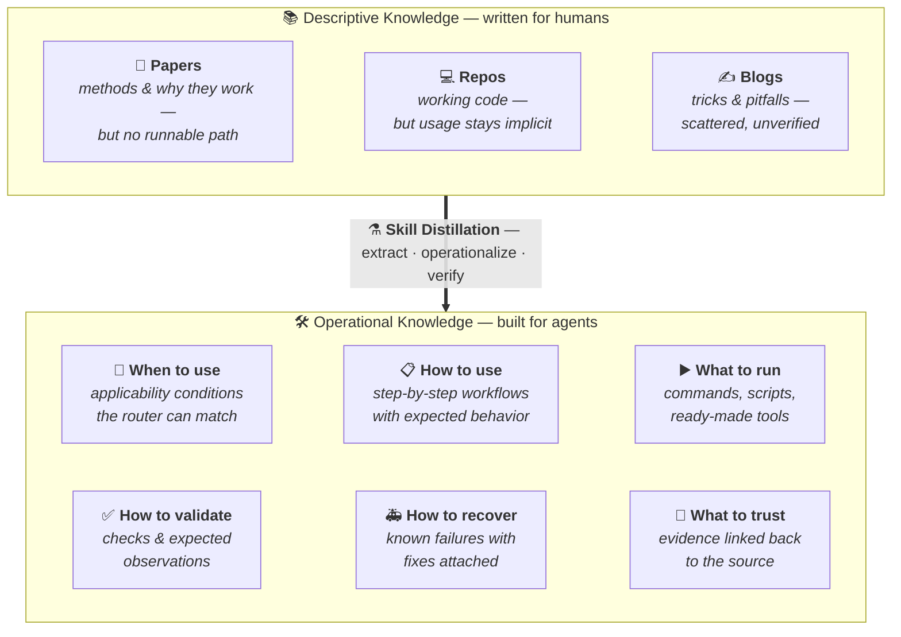
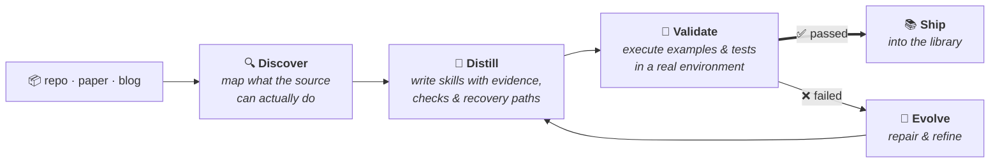
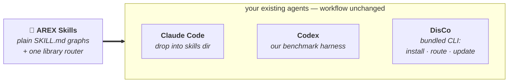
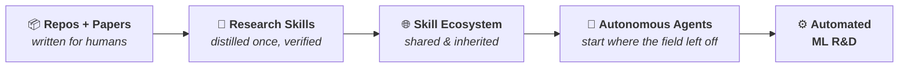

<h1 align="center">AREX-Skill</h1>

<p align="center">
  <strong>Turn Repos & Papers into Skills for Autonomous ML Research</strong>
</p>

<p align="center">
  An open library of <b>5,000+ verified, executable skills</b> distilled from
  <b>1,000 ML repositories</b> — and the agent that builds them.
</p>

<p align="center">
  <a href="skills/README.md"></a>
  <a href="skills/repositories/repo-skills/"></a>
  <a href="https://www.npmjs.com/package/@auto-ml-skills/disco"></a>
  <a href="LICENSE"></a>
</p>

<p align="center">
  <b>English</b> | <a href="README.zh-CN.md">简体中文</a>
</p>



> **Same agent. Same budget. 2.3× the wins.**
> MLE-bench sets agents loose on 75 Kaggle ML competitions. With AREX skills,
> vanilla Codex goes from winning medals in **31%** of them to **73%** —
> outscoring every public leaderboard entry. Skills, not agent engineering.

---

## 🧭 Table of Contents <a id="table-of-contents"></a>

- [News](#news)
- [Why AREX-Skill](#why-arex-skill)
- [From Knowledge to Skills](#from-knowledge-to-skills)
- [What Is an AREX Skill](#what-is-an-arex-skill)
- [How AREX-Skill Is Built: DisCo](#how-arex-builds-skills)
- [Works With Your Coding Agent](#works-with-your-coding-agent)
- [Library Scale](#library-scale)
- [Skill Gallery](#skill-gallery)
- [Do Skills Make Agents Better Researchers](#do-skills-make-agents-better-researchers)
- [Quick Start](#quick-start)
- [The Bigger Vision](#the-bigger-vision)
- [Contributing](#contributing)
- [Documentation](#documentation)
- [Acknowledgement](#acknowledgement)
- [License](#license)
- [Citation](#citation)

---

## 📣 News <a id="news"></a>

- **2026-08-27**: The library scales to **1,000 repositories and 5,000+ skills**,
  with a rebuilt router covering every repo. Technical report coming soon,
  with full benchmark results on MLE-bench, PaperBench, Frontier-CS, and
  PassNet.
- **2026-08-03**: AREX-Skill launches with DisCo's Creator and Researcher
  workflows and the initial AREX-Skill Library release: 1,000+ operating
  skills for 170 widely used repositories.

---

## 💡 Why AREX-Skill <a id="why-arex-skill"></a>

**Research knowledge is everywhere. Agents still can't use it well.**

| 📄 **Papers** | 💻 **Codebases** | 🤖 **Agents** |
|:---:|:---:|:---:|
| Explain *why* things work | Contain *working* implementations | Still have to *rediscover everything* |

Papers, repositories, and blogs hold nearly all of the field's know-how — but
they are written for human readers. They are loose, heterogeneous, and expose
no interface an agent can call. So on every task, an agent burns its context
window and execution budget searching, reading, and trial-and-erroring its way
back to knowledge the field already wrote down.

We call the missing layer **operating knowledge**: the know-how that separates
*knowing a method* from *making it work*. AREX-Skill pre-compiles it, once, into
skills.

---

## 🧠 From Knowledge to Skills <a id="from-knowledge-to-skills"></a>

> **We don't summarize repositories. We compile them into skills agents can execute.**



The output is not a summary and not a RAG index. It is **Knowledge →
Capability**: a skill declares its use conditions, execution behavior,
supporting evidence, validation steps, and failure handling — everything an
agent needs to act, verify, and recover without re-deriving the source.

---

## 🧩 What Is an AREX Skill <a id="what-is-an-arex-skill"></a>

An AREX Skill is a self-contained, agent-readable unit of operating knowledge.
It follows the open [Agent Skills](https://github.com/agentskills/agentskills)
format and is organized around `SKILL.md`, with optional supporting resources:

```text
AREX Skill
│
├── 🧭 SKILL.md: Entry Point / Router
│   ├── applicability and scope
│   ├── task routing
│   ├── operating workflows
│   └── validation and troubleshooting
│
├── 📖 references/: Focused Instructions
│   ├── installation and configuration
│   ├── detailed workflows
│   └── troubleshooting and provenance
│
└── 🛠 scripts/: Executable Helpers
    ├── diagnostics and smoke tests
    ├── workflow utilities
    └── compatibility and reusable helpers
```

`SKILL.md` is the entry point for the skill's scope, operating instructions,
and—when applicable—task routing. `references/` and `scripts/` are optional:
references provide focused guidance and provenance, while scripts provide
executable helpers for diagnostics, workflows, and repeatable checks.

When a repository exposes several workflows, its skills can be organized as a
repository skill graph. A root skill routes the task to focused sub-skills:

```text
Repository Skill Graph
│
├── root SKILL.md: entry point and router
└── sub-skills/
    ├── inference/SKILL.md
    ├── training/SKILL.md
    └── evaluation/SKILL.md
```

Each sub-skill is an individual AREX Skill and may have its own references and
scripts. The links from the root to its sub-skills form a **skill graph**—an
AREX-Skill extension that supports progressive disclosure, so the agent reads
only the branch required by the task.

---

## ⚗️ How AREX-Skill Is Built: DisCo <a id="how-arex-builds-skills"></a>

**The AREX-Skill Library is built through DisCo's discover, distill, and verify
workflow.**



An ordinary repo-to-doc tool stops at `Repo → Documentation`. DisCo's Creator
agent runs a full experimental loop — evidence-backed exploration, skill-graph
generation, then **verification with refinement**: generated checks and native
examples are executed, failures are repaired, and the loop repeats until the
graph passes or the budget is spent. Skills ship only after they survive their
own tests.

---

## 🤖 Works With Your Coding Agent <a id="works-with-your-coding-agent"></a>

**No new agent. No new workflow.**



Skills are plain `SKILL.md` graphs in the emerging agent-skills format. Drop
them into the coding agent you already use — no proprietary runtime, no new
research platform to migrate to. The bundled [DisCo CLI](cli/) manages
installation, routing, and updates, and our benchmark results below use
unmodified Codex as the harness.

---

## 📊 Library Scale <a id="library-scale"></a>

<table align="center">
  <tr>
    <td align="center"><h2>1,000</h2>widely used<br>ML repositories</td>
    <td align="center"><h2>5,000+</h2>autonomously distilled<br>& verified skills</td>
    <td align="center"><h2>20</h2>research areas,<br>178 task families</td>
  </tr>
</table>

<p align="center">Sources: GitHub · Papers · Technical Blogs</p>

This is not a demo. It is the first scale point of a growing **Machine
Learning Research Skill Library** — from training infrastructure, LLM
alignment, and inference serving to robotics, genomics, and scientific
computing. The [catalog](docs/imported-repo-skills.md) lists every graph with
its upstream repository, source commit, and coverage.

---

## 🖼️ Skill Gallery <a id="skill-gallery"></a>

What a skill looks like in practice — source → skill → one prompt:

| | Source | Skill | Ask your agent |
|---|---|---|---|
| 🔍 | [FAISS](skills/repositories/repo-skills/faiss/) | Vector search & index composition | *"Optimize this FAISS index for lower latency at recall ≥ 0.95."* |
| ⚡ | [vLLM](skills/repositories/repo-skills/vllm/) | High-throughput LLM serving | *"Benchmark vLLM vs SGLang on this model and report verified throughput."* |
| 🧠 | [Unsloth](skills/repositories/repo-skills/unsloth/) | Efficient LLM fine-tuning | *"Fine-tune Llama on this dataset within 24 GB VRAM."* |
| 🔥 | [Diffusers](skills/repositories/repo-skills/diffusers/) | Diffusion training & inference | *"Train a LoRA for this style and validate outputs."* |
| 🦾 | [LeRobot](skills/repositories/repo-skills/lerobot/) | Robot learning workflows | *"Train and evaluate an ACT policy on this manipulation dataset."* |
| 🧬 | [AlphaFold2](skills/repositories/repo-skills/alphafold2/) | Protein structure prediction | *"Fold these sequences and check confidence metrics."* |

Every graph follows the same contract: a routed entry skill, focused
sub-skills for real workflows (data, training, evaluation, serving,
troubleshooting), and validation steps the agent can actually run.

---

## 📈 Do Skills Make Agents Better Researchers <a id="do-skills-make-agents-better-researchers"></a>

We hold everything fixed — **Codex harness, GPT-5.5 (xhigh) backbone, same
execution budget** — and change exactly one thing: whether the agent has
AREX-distilled skills.

```text
MLE-bench (medal rate across 75 Kaggle competitions)
  without skills   ███████░░░░░░░░░░░░░░░░  31.1%
  with skills      █████████████████░░░░░░  72.9%   (+134% relative)

PaperBench (replication score, 20 papers)
  without skills   ███████░░░░░░░░░░░░░░░░  29.5
  with skills      █████████░░░░░░░░░░░░░░  39.6    (+34% relative)
```

| Benchmark | Metric | Codex | Codex + AREX-Skill | Δ |
| --- | --- | ---: | ---: | ---: |
| **MLE-bench** (full, 75 tasks) | Medal rate (Any Medal) % | 31.11 | **72.89** | **+41.78** |
| **PaperBench** (full, 20 papers) | Replication score | 29.45 | **39.59** | **+10.14** |
| **Frontier-CS** (Agent Track, 188 tasks) | Score | 70.63 | **77.14** | **+6.51** |
| **PassNet** (200 samples) | AS Score | 1.343 | **1.531** | **+14.0%** |

Highlights from the technical report (release coming soon):

- **Beyond agent engineering.** Vanilla Codex + skills tops the strongest
  public MLE-bench entries (72.89 vs 64.44) — no custom harness, no modified
  control loop, only distilled operating knowledge.
- **The advantage grows with difficulty.** On MLE-bench High-tier tasks the
  score rises from 13.3% to 62.2% (4.7×); skills matter most exactly where
  unguided trial-and-error is most expensive.
- **Recovery, not just polish.** The largest gains land on tasks where the
  no-skill agent nearly fails (PaperBench `rice`: 7.9 → 48.5; Frontier-CS
  tasks scoring <50 gain +26.6 on average).
- **Efficiency, not brute force.** On Frontier-CS, Codex + AREX-Skill
  Pareto-dominates the leaderboard's Claude Code entries on score, tokens,
  steps, and tool calls, using ~3× fewer tokens.

### 💡 Why it helps <a id="why-it-helps"></a>

```text
Without AREX                    With AREX
────────────                    ─────────
Search the web                  Route to skill
Inspect the repo                Execute known workflow
Guess an approach               Validate against checks
Debug from scratch              Optimize the target metric
Retry, repeat…
```

Benchmarks show *that* performance improves; the operating pattern shows
*why*: the agent enters a productive region of the solution space early and
spends its budget on the choices that move the metric. See a full
[Creator session](examples/creator/) building a FlagEmbedding graph and a
[Researcher session](examples/researcher/) applying Gymnasium +
Stable-Baselines3 skills to an auditable RL experiment.

---

## 🚀 Quick Start <a id="quick-start"></a>

Three steps to a skill-powered research agent:

```bash
# 1. Install the DisCo CLI (Node.js >= 22.19)
npm install -g @auto-ml-skills/disco

# 2. Install the skill library (1,000 repos + router)
disco repo-skills install

# 3. Research with skills
disco -p "Use the installed skills to benchmark vLLM and SGLang \
on this machine and report verified throughput for each."
```

Configure a model provider on first run with `/login` or environment variables
(`ANTHROPIC_API_KEY`, `OPENAI_API_KEY`, `GEMINI_API_KEY`, …).

<details>
<summary><b>Create your own skills (Creator mode)</b></summary>

DisCo's Creator mode distills new skill graphs from any repository or paper,
then verifies them before import:

```bash
git clone https://github.com/FlagOpen/FlagEmbedding.git
disco --agent-mode creator -p \
  "/skill:distill-ml-knowledge Create and verify a repository skill graph \
for ./FlagEmbedding covering embedding inference and evaluation."
```

Researcher is the default mode; switch with `--agent-mode creator|researcher`
or `/creator` · `/researcher` in the UI. See
[DisCo Workflows](docs/disco-workflows.md) for the 15 bundled Creator meta
skills, verification gates, and maintenance workflows.

</details>

<details>
<summary><b>Use the skills in another agent, manage the collection, build from source</b></summary>

- **Other agents**: skills are standard `SKILL.md` graphs; see
  [Meta Skills For Other Agents](docs/meta-skills-for-other-agents.md) for
  Claude Code / Codex installation.
- **Manage**: `disco repo-skills status | update`, router toggle with
  `disco repo-skills router disable|enable`.
- **Manual install**: copy `skills/repositories/repo-skills` and
  `skills/repositories/repo-skills-router` into
  `~/.disco/agent/skills/repositories/`.
- **From source**: `bash scripts/build-from-source-link.sh` after cloning.

The full [Installation Guide](docs/installation.md) covers provider setup,
update/backup semantics, router behavior, and every fallback path.

</details>

---

## 🌐 The Bigger Vision <a id="the-bigger-vision"></a>

**From repositories to skills. From skills to autonomous research.**

> Today's research knowledge is written for humans.
> AREX turns it into operating knowledge for AI researchers.



Every skill distilled once is inherited by every agent afterward. As the
library grows — more repositories, more papers, more task families — each
research task starts a little further from zero. We believe ML research
knowledge should exist not only as papers and repos, but as skills that AI
researchers can directly call.

> **Naming note:** AREX-Skill is the project and the published AREX-Skill
> Library. DisCo is the bundled skill-powered CLI/runtime that creates skills
> (Creator) and researches with them (Researcher).

---

## 🤝 Contributing <a id="contributing"></a>

We welcome three kinds of contributions — new repo skills, refreshes of
existing skills, and DisCo CLI improvements. Skill PRs should include
provenance (model, source commit, verification steps); see
[CONTRIBUTING.md](CONTRIBUTING.md) for the checklist and
[Contributing docs](CONTRIBUTING.md) for the repo-skill layout and router
update workflow.

## 📚 Documentation <a id="documentation"></a>

| Page | Description |
| --- | --- |
| [Installation Guide](docs/installation.md) | Full CLI and skill-collection installation, provider setup, router toggle, manual fallback. |
| [DisCo Workflows](docs/disco-workflows.md) | Modes, sessions, Researcher execution, Creator construction, deployment scopes. |
| [AREX-Skill Library](skills/README.md) | Library model, collection layout, installation. |
| [Imported Repo Skills Catalog](docs/imported-repo-skills.md) | Every published graph with upstream baselines. |
| [Repository Catalog](docs/repository-catalog.md) | Human-readable area -> family inventory of all published repository skills. |
| [Architecture](docs/architecture.md) | Repository layers, routing, authoring pipelines, deployment scopes. |
| [Examples](examples/) | Sanitized end-to-end Creator and Researcher sessions. |
| [Bundled Skills Reference](cli/packages/coding-agent/src/disco/skills/README.md) | Creator meta-skill contracts and artifact layouts. |
| [DisCo CLI README](cli/README.md) | CLI usage, runtime skill routing, packages. |

## 🙏 Acknowledgement <a id="acknowledgement"></a>

DisCo's CLI and agent runtime are built on the foundation of
[earendil-works/pi](https://github.com/earendil-works/pi), an open-source AI
agent toolkit with a unified LLM API, agent loop, terminal UI, and coding-agent
CLI.

AREX-Skill is also made possible by the open-source community on GitHub. The
repository skills in this library build on high-quality ML, agent, data,
bio/chemistry, vision, and infrastructure projects released by researchers and
engineers around the world. We are grateful to everyone who makes that work
available for the community to use and build on.

## 📄 License <a id="license"></a>

Unless a file or component states otherwise, repository-level AREX-Skill
materials are released under the Apache License 2.0. The skills published in
the library are licensed separately: before using, copying, modifying, or
redistributing a skill, inspect the `license` metadata field in that skill's
`SKILL.md`. That license is authoritative for the individual skill, may differ
from this repository's Apache-2.0 license, and may include additional terms or
restrictions. Users are responsible for reviewing and complying with the terms
of every individual skill they use.

The standalone DisCo npm package under [`cli/`](cli/) is distributed under its
own [MIT License](cli/LICENSE), with upstream attribution in
[`cli/THIRD_PARTY_NOTICES.md`](cli/THIRD_PARTY_NOTICES.md).

## 📝 Citation <a id="citation"></a>

TBA
