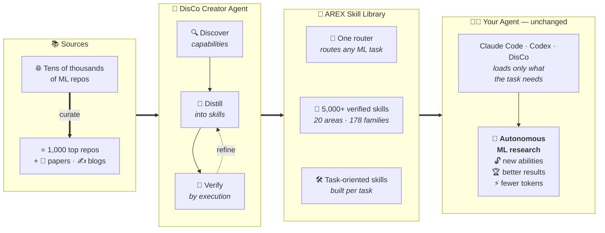
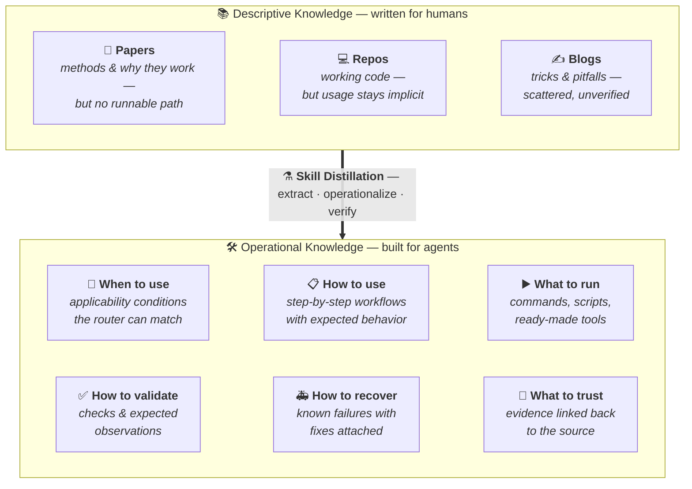
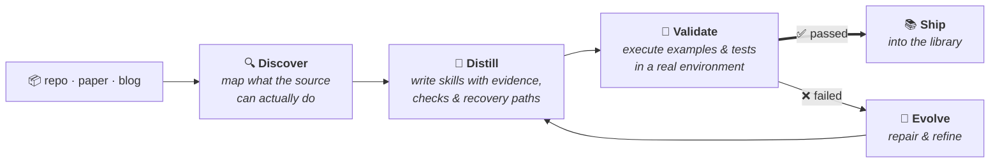
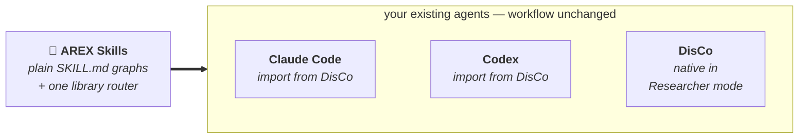
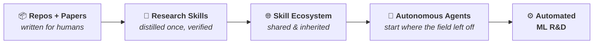

<h1 align="center">AREX-Skill</h1>

<p align="center">
  <strong>Turn Repos & Papers into Skills for Autonomous ML Research</strong>
</p>

<p align="center">
  An open library of <b>5,000+ verified, executable skills</b> distilled from
  <b>1,000 ML repositories</b> — and the agent that builds them.
</p>

<p align="center">
  <a href="skills/README.md"></a>
  <a href="skills/repositories/repo-skills/"></a>
  <a href="https://www.npmjs.com/package/@auto-ml-skills/disco"></a>
  <a href="LICENSE"></a>
</p>

<p align="center">
  <b>English</b> | <a href="README.zh-CN.md">简体中文</a>
</p>



> **Same agent. Same budget. 2.3× the wins.**
> MLE-bench sets agents loose on 75 Kaggle ML competitions. With AREX skills,
> vanilla Codex goes from winning medals in **31%** of them to **73%** —
> outscoring every public leaderboard entry. Skills, not agent engineering.

---

## 🧭 Table of Contents <a id="table-of-contents"></a>

- [News](#news)
- [Why AREX-Skill](#why-arex-skill)
- [From Knowledge to Skills](#from-knowledge-to-skills)
- [What Is an AREX Skill](#what-is-an-arex-skill)
- [Router Design](#router-design)
- [How AREX-Skill Is Built: DisCo](#how-arex-builds-skills)
- [Library Scale](#library-scale)
- [Skill Gallery](#skill-gallery)
- [Do Skills Make Agents Better Researchers](#do-skills-make-agents-better-researchers)
- [Quick Start](#quick-start)
- [Works With Your Coding Agent](#works-with-your-coding-agent)
- [The Bigger Vision](#the-bigger-vision)
- [Contributing](#contributing)
- [Documentation](#documentation)
- [Acknowledgement](#acknowledgement)
- [License](#license)
- [Citation](#citation)

---

## 📣 News <a id="news"></a>

- **2026-08-27**: The library scales to **1,000 repositories and 5,000+ skills**,
  with a rebuilt router covering every repo. Technical report coming soon,
  with full benchmark results on MLE-bench, PaperBench, Frontier-CS, and
  PassNet.
- **2026-08-03**: AREX-Skill launches with DisCo's Creator and Researcher
  workflows and the initial AREX-Skill Library release: 1,000+ operating
  skills for 170 widely used repositories.

---

## 💡 Why AREX-Skill <a id="why-arex-skill"></a>

**Research knowledge is everywhere. Agents still can't use it well.**

| 📄 **Papers** | 💻 **Codebases** | 🤖 **Agents** |
|:---:|:---:|:---:|
| Explain *why* things work | Contain *working* implementations | Still have to *rediscover everything* |

Papers, repositories, and blogs hold nearly all of the field's know-how — but
they are written for human readers. They are loose, heterogeneous, and expose
no interface an agent can call. So on every task, an agent burns its context
window and execution budget searching, reading, and trial-and-erroring its way
back to knowledge the field already wrote down.

We call the missing layer **operating knowledge**: the know-how that separates
*knowing a method* from *making it work*. AREX-Skill pre-compiles it, once, into
skills.

---

## 🧠 From Knowledge to Skills <a id="from-knowledge-to-skills"></a>

> **We don't summarize repositories. We compile them into skills agents can execute.**



The output is not a summary and not a RAG index. It is **Knowledge →
Capability**: a skill declares its use conditions, execution behavior,
supporting evidence, validation steps, and failure handling — everything an
agent needs to act, verify, and recover without re-deriving the source.

---

## 🧩 What Is an AREX Skill <a id="what-is-an-arex-skill"></a>

An AREX Skill is a self-contained, agent-readable unit of operating knowledge.
It follows the open [Agent Skills](https://github.com/agentskills/agentskills)
format and is organized around `SKILL.md`, with optional supporting resources:

```text
AREX Skill
│
├── 🧭 SKILL.md: Entry Point / Router
│   ├── applicability and scope
│   ├── task routing
│   ├── operating workflows
│   └── validation and troubleshooting
│
├── 📖 references/: Focused Instructions
│   ├── installation and configuration
│   ├── detailed workflows
│   └── troubleshooting and provenance
│
└── 🛠 scripts/: Executable Helpers
    ├── diagnostics and smoke tests
    ├── workflow utilities
    └── compatibility and reusable helpers
```

`SKILL.md` is the entry point for the skill's scope, operating instructions,
and—when applicable—task routing. `references/` and `scripts/` are optional:
references provide focused guidance and provenance, while scripts provide
executable helpers for diagnostics, workflows, and repeatable checks.

When a repository exposes several workflows, its skills can be organized as a
repository skill graph. A root skill routes the task to focused sub-skills:

```text
Repository Skill Graph
│
├── root SKILL.md: entry point and router
└── sub-skills/
    ├── inference/SKILL.md
    ├── training/SKILL.md
    └── evaluation/SKILL.md
```

Each sub-skill is an individual AREX Skill and may have its own references and
scripts. The links from the root to its sub-skills form a **skill graph**—an
AREX-Skill extension that supports progressive disclosure, so the agent reads
only the branch required by the task.

### 🧭 Router Design <a id="router-design"></a>

The published repository collection currently uses a router that is itself an
AREX Skill: [`repo-skills-router/SKILL.md`](skills/repositories/repo-skills-router/SKILL.md).
It describes available capabilities and links to repository skill graphs; it is
not a separate black-box routing service or a required proprietary runtime.

The agent is expected to follow a **progressive disclosure** strategy: read the
router first, identify the relevant repository or workflow, then load only the
matching skill branch and its `references/` or `scripts/` when needed. This keeps
the initial context focused while allowing deeper instructions and executable
helpers to be loaded for the task at hand.

This `SKILL.md` router is the current portable baseline, not the only possible
design. Depending on the agent runtime, latency, cost, privacy, and control
requirements, users can build other routing layers, for example:

1. **Query subagent.** Give the main agent a dedicated subagent that searches
   the skill library, selects candidate skills, and returns skill paths or a
   loading plan for the main agent to review and execute.
2. **Retrieval tool.** Expose a tool backed by an embedding model, reranking
   model, or another retrieval component. The main agent submits the task,
   receives ranked skill candidates, and then loads the relevant graph branches.

Any alternative should preserve clear scope, progressive loading, provenance,
and verification boundaries. AREX provides a portable `SKILL.md` router
baseline, while users remain free to design the routing architecture that best
fits their agent.

---

## ⚗️ How AREX-Skill Is Built: DisCo <a id="how-arex-builds-skills"></a>

**The AREX-Skill Library is built through DisCo's discover, distill, and verify
workflow.**



An ordinary repo-to-doc tool stops at `Repo → Documentation`. DisCo's Creator
agent runs a full experimental loop — evidence-backed exploration, skill-graph
generation, then **verification with refinement**: generated checks and native
examples are executed, failures are repaired, and the loop repeats until the
graph passes or the budget is spent. Skills ship only after they survive their
own tests.

---

## 📊 Library Scale <a id="library-scale"></a>

<p align="center">
  
</p>

This is not a demo. It is a growing **AREX-Skill Library**
covering **20 research areas**, **178 package families**, **1,000 repositories**,
and **5,000+ verified skills** — from training infrastructure, LLM alignment,
and inference serving to robotics, genomics, and scientific computing. The
[catalog](docs/imported-repo-skills.md) lists every graph with its upstream
repository, source commit, and coverage.

### 🔄 Library Maintenance <a id="library-maintenance"></a>

Upstream repositories keep changing, so repo skills are maintained rather than
treated as permanent snapshots. Our default maintenance target is to refresh the
published repo skills about once a month, while major upstream changes, critical
bugs, or security issues may trigger an earlier refresh. The monthly cadence is
an operating target, not a fixed service-level commitment for every repository.

The community is welcome to refresh individual repo skills at any time. A
refresh contribution should use current upstream evidence, record the new source
commit and verification steps, and update the router or catalog when routing or
coverage changes. Each skill's own `SKILL.md` license continues to apply to
refreshes and contributions. See the [Refreshing Repo Skills](docs/refreshing-repo-skills.md)
guide for the DisCo workflow, synchronization checklist, and pull request
requirements.

---

## 🖼️ Skill Gallery <a id="skill-gallery"></a>

What a skill looks like in practice — source → skill → one prompt:

| | Source | Skill | Ask your agent |
|---|---|---|---|
| 🔍 | [FAISS](skills/repositories/repo-skills/faiss/) | Vector search & index composition | *"Optimize this FAISS index for lower latency at recall ≥ 0.95."* |
| ⚡ | [vLLM](skills/repositories/repo-skills/vllm/) | High-throughput LLM serving | *"Benchmark vLLM vs SGLang on this model and report verified throughput."* |
| 🧠 | [Unsloth](skills/repositories/repo-skills/unsloth/) | Efficient LLM fine-tuning | *"Fine-tune Llama on this dataset within 24 GB VRAM."* |
| 🔥 | [Diffusers](skills/repositories/repo-skills/diffusers/) | Diffusion training & inference | *"Train a LoRA for this style and validate outputs."* |
| 🦾 | [LeRobot](skills/repositories/repo-skills/lerobot/) | Robot learning workflows | *"Train and evaluate an ACT policy on this manipulation dataset."* |
| 🧬 | [AlphaFold2](skills/repositories/repo-skills/alphafold2/) | Protein structure prediction | *"Fold these sequences and check confidence metrics."* |

Every graph follows the same contract: a routed entry skill, focused
sub-skills for real workflows (data, training, evaluation, serving,
troubleshooting), and validation steps the agent can actually run.

---

## 📈 Do Skills Make Agents Better Researchers <a id="do-skills-make-agents-better-researchers"></a>

We hold everything fixed — **Codex harness, GPT-5.5 (xhigh) backbone, same
execution budget** — and change exactly one thing: whether the agent has
AREX-distilled skills.

```text
MLE-bench (medal rate across 75 Kaggle competitions)
  without skills   ███████░░░░░░░░░░░░░░░░  31.1%
  with skills      █████████████████░░░░░░  72.9%   (+134% relative)

PaperBench (replication score, 20 papers)
  without skills   ███████░░░░░░░░░░░░░░░░  29.5
  with skills      █████████░░░░░░░░░░░░░░  39.6    (+34% relative)
```

| Benchmark | Metric | Codex | Codex + AREX-Skill | Δ |
| --- | --- | ---: | ---: | ---: |
| **MLE-bench** (full, 75 tasks) | Medal rate (Any Medal) % | 31.11 | **72.89** | **+41.78** |
| **PaperBench** (full, 20 papers) | Replication score | 29.45 | **39.59** | **+10.14** |
| **Frontier-CS** (Agent Track, 188 tasks) | Score | 70.63 | **77.14** | **+6.51** |
| **PassNet** (200 samples) | AS Score | 1.343 | **1.531** | **+14.0%** |

Highlights from the technical report (release coming soon):

- **Beyond agent engineering.** Vanilla Codex + skills tops the strongest
  public MLE-bench entries (72.89 vs 64.44) — no custom harness, no modified
  control loop, only distilled operating knowledge.
- **The advantage grows with difficulty.** On MLE-bench High-tier tasks the
  score rises from 13.3% to 62.2% (4.7×); skills matter most exactly where
  unguided trial-and-error is most expensive.
- **Recovery, not just polish.** The largest gains land on tasks where the
  no-skill agent nearly fails (PaperBench `rice`: 7.9 → 48.5; Frontier-CS
  tasks scoring <50 gain +26.6 on average).
- **Efficiency, not brute force.** On Frontier-CS, Codex + AREX-Skill
  Pareto-dominates the leaderboard's Claude Code entries on score, tokens,
  steps, and tool calls, using ~3× fewer tokens.

### 💡 Why it helps <a id="why-it-helps"></a>

```text
Without AREX                    With AREX
────────────                    ─────────
Search the web                  Route to skill
Inspect the repo                Execute known workflow
Guess an approach               Validate against checks
Debug from scratch              Optimize the target metric
Retry, repeat…
```

Benchmarks show *that* performance improves; the operating pattern shows
*why*: the agent enters a productive region of the solution space early and
spends its budget on the choices that move the metric. See a full
[Creator session](examples/creator/) building a FlagEmbedding graph and a
[Researcher session](examples/researcher/) applying Gymnasium +
Stable-Baselines3 skills to an auditable RL experiment.

---

## 🚀 Quick Start <a id="quick-start"></a>

Install the CLI, add the AREX-Skill Library, and open an interactive Researcher
session:

```bash
# 1. Install the DisCo CLI (Node.js >= 22.19)
npm install -g @auto-ml-skills/disco

# 2. Install the AREX-Skill Library (1,000 repos + router)
disco repo-skills install

# 3. Open the interactive DisCo CLI (Researcher mode)
disco
```

At the DisCo prompt, enter research tasks directly:

```text
Use the installed skills to benchmark vLLM and SGLang on this machine and report verified throughput for each.
```

Configure a model provider on first run with `/login` or environment variables
(`ANTHROPIC_API_KEY`, `OPENAI_API_KEY`, `GEMINI_API_KEY`, …). DisCo is an
interactive terminal CLI; `-p` / `--print` is only the optional non-interactive
mode that processes one prompt and exits, which is useful for scripts and
automation. Run `disco --help` to see all CLI commands and options.

<details>
<summary><b>Create your own skills (Creator mode)</b></summary>

DisCo's Creator mode distills new skill graphs from any repository or paper,
then verifies them before import:

```bash
git clone https://github.com/FlagOpen/FlagEmbedding.git
disco --creator
```

Then enter the workflow request at the DisCo prompt:

```text
/skill:distill-ml-knowledge Create and verify a repository skill graph for ./FlagEmbedding covering embedding inference and evaluation.
```

Researcher is the default mode; start explicitly with `--creator` or
`--researcher`, or use `/creator` · `/researcher` in the UI. See
[DisCo Meta Skills](docs/disco-meta-skills.md) for the complete catalog and
portable installation guide, and [DisCo Workflows](docs/disco-workflows.md)
for verification gates and maintenance workflows.

</details>

For installation and maintenance details, see the
[Installation Guide](docs/installation.md). It documents npm and source builds
of the DisCo CLI, provider configuration, AREX-Skill Library
install/status/update behavior (including conflict handling and recoverable
backups), router controls, manual installation, and optional portable Creator
meta-skill installation for other agents.

---

## 🤖 Works With Your Coding Agent <a id="works-with-your-coding-agent"></a>

**No new agent. No new workflow.**



Skills are plain `SKILL.md` graphs in the emerging agent-skills format. DisCo
Researcher loads and routes the AREX-Skill Library natively; the Creator
workflow can export selected skills and a scoped router to Codex or Claude
Code. No proprietary skill runtime or workflow migration is required. The
bundled [DisCo CLI](cli/) manages installation, routing, export, and updates.

To export selected repository skills from DisCo's managed collection into
another compatible agent, run the Creator workflow after
`disco repo-skills install`:

```bash
disco --creator
```

For Codex, which writes to `~/.agents/skills/repositories/`, enter:

```text
/skill:import-repo-skills-to-agent import vllm and sglang to Codex
```

For Claude Code, which writes to `~/.claude/skills/repositories/`, enter:

```text
/skill:import-repo-skills-to-agent import vllm and sglang to Claude Code
```

The workflow copies the selected skills into
`repositories/repo-skills/`, builds or merges a scoped
`repositories/repo-skills-router/`, and adds Codex-specific
`agents/openai.yaml` policy files when the target is Codex. Restart the target
agent after import so it reloads the new skills. For portable Creator meta
skills and manual target setup, see
[DisCo Meta Skills](docs/disco-meta-skills.md).

---

## 🌐 The Bigger Vision <a id="the-bigger-vision"></a>

**From repositories to skills. From skills to autonomous research.**

> Today's research knowledge is written for humans.
> AREX turns it into operating knowledge for AI researchers.



Every skill distilled once is inherited by every agent afterward. As the
library grows — more repositories, more papers, more task families — each
research task starts a little further from zero. We believe ML research
knowledge should exist not only as papers and repos, but as skills that AI
researchers can directly call.

> **Naming note:** AREX-Skill is the project and the published AREX-Skill
> Library. DisCo is the bundled skill-powered CLI/runtime that creates skills
> (Creator) and researches with them (Researcher).

---

## 🤝 Contributing <a id="contributing"></a>

We welcome contributions in three areas:

1. **Add repo skills.** Contribute a verified skill under
   `skills/repositories/repo-skills/<skill-id>/`, then update the sibling router
   and public catalog so agents can discover it.
2. **Refresh or extend existing skills.** Update stale guidance or add deeper
   coverage using current upstream evidence. The default library cadence is
   roughly monthly, but focused community refreshes are welcome at any time;
   keep provenance, verification, license, and routing metadata aligned. See
   [Refreshing Repo Skills](docs/refreshing-repo-skills.md) for the detailed
   workflow and PR checklist.
3. **Improve the DisCo CLI.** Contribute CLI/runtime or bundled repository and
   paper workflow changes under `cli/`.

For skill PRs, include the model and provider, source commit, and verification
steps; update the router and catalog when routing changes. See the
[Contribution Guide](CONTRIBUTING.md) for the complete checklist.

## 📚 Documentation <a id="documentation"></a>

| Page | Description |
| --- | --- |
| [Installation Guide](docs/installation.md) | DisCo npm/source installation, provider setup, Library install/status/update behavior, conflict backups, router controls, manual fallback, portable Creator meta-skill installation. |
| [DisCo Workflows](docs/disco-workflows.md) | Modes, sessions, Researcher execution, Creator construction, deployment scopes. |
| [Refreshing Repo Skills](docs/refreshing-repo-skills.md) | Refresh an existing repository skill with DisCo, synchronize runtime and publication metadata, verify the result, and prepare a contribution PR. |
| [DisCo Meta Skills](docs/disco-meta-skills.md) | Complete Creator meta-skill catalog and portable installation into other agents. |
| [AREX-Skill Library](skills/README.md) | Library model, collection layout, installation. |
| [Imported Repo Skills Catalog](docs/imported-repo-skills.md) | Every published graph with upstream baselines. |
| [Repository Catalog](docs/repository-catalog.md) | Human-readable area -> family inventory of all published repository skills. |
| [Architecture](docs/architecture.md) | Repository layers, routing, authoring pipelines, deployment scopes. |
| [Examples](examples/) | Sanitized end-to-end Creator and Researcher sessions. |
| [Bundled Skills Reference](cli/packages/coding-agent/src/disco/skills/README.md) | Creator meta-skill contracts and artifact layouts. |
| [DisCo CLI README](cli/README.md) | CLI usage, runtime skill routing, packages. |

## 🙏 Acknowledgement <a id="acknowledgement"></a>

DisCo's CLI and agent runtime are built on the foundation of
[earendil-works/pi](https://github.com/earendil-works/pi), an open-source AI
agent toolkit with a unified LLM API, agent loop, terminal UI, and coding-agent
CLI.

AREX-Skill is also made possible by the open-source community on GitHub. The
repository skills in this library build on high-quality ML, agent, data,
bio/chemistry, vision, and infrastructure projects released by researchers and
engineers around the world. We are grateful to everyone who makes that work
available for the community to use and build on.

## 📄 License <a id="license"></a>

Unless a file or component states otherwise, repository-level AREX-Skill
materials are released under the Apache License 2.0.

> ⚠️ **Every skill in the AREX-Skill Library has its own license.** Before
> using, copying, modifying, or redistributing a skill, check the `license`
> metadata field in that skill's `SKILL.md`. **The per-skill license is
> authoritative for that skill, not this repository's Apache-2.0 license.** It
> may contain different terms, additional conditions, or restrictions. You are
> responsible for reviewing and complying with each skill's license.

The standalone DisCo npm package under [`cli/`](cli/) is distributed under its
own [MIT License](cli/LICENSE), with upstream attribution in
[`cli/THIRD_PARTY_NOTICES.md`](cli/THIRD_PARTY_NOTICES.md).

## 📝 Citation <a id="citation"></a>

TBA
