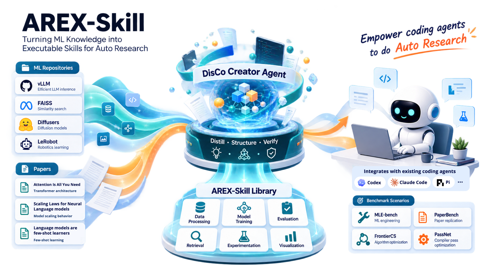
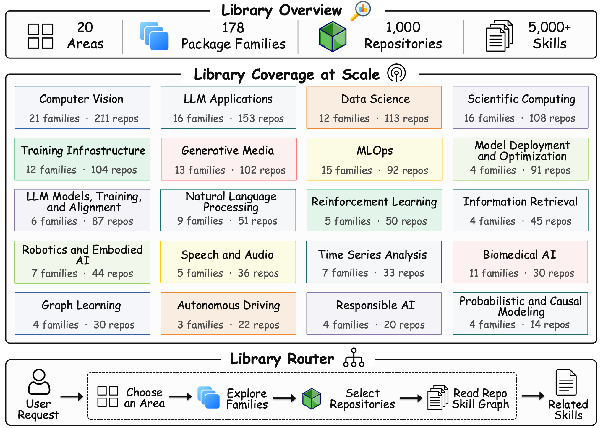
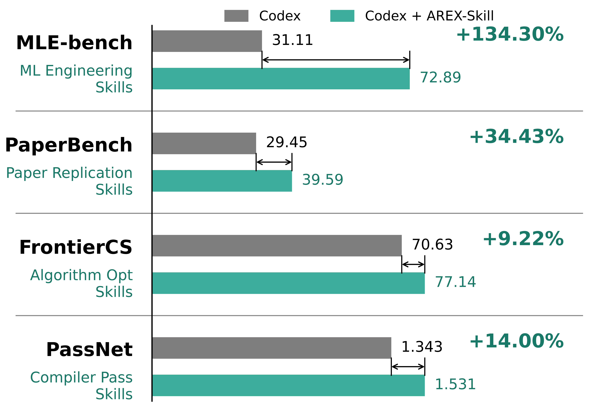
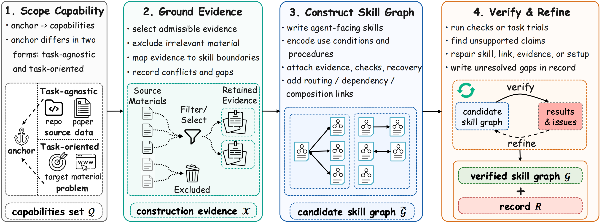

<p align="center">
  
</p>


<h1 align="center">
  AREX-Skill
  <br>
  <sub>✨ Advancing Autonomous Research with Skills Distilled from GitHub Repos 🚀</sub>
</h1>

<p align="center">
  <a href="skills/README.md"></a>
  <a href="docs/repository-catalog.md"></a>
  <a href="https://www.npmjs.com/package/@auto-ml-skills/disco"></a>
  <a href="LICENSE"></a>
  <a href="#documentation"></a>
  <a href="#contributing"></a>
</p>

<p align="center">
  <b>English</b> · <a href="README.zh-CN.md">简体中文</a>
</p>

<p align="center"> 
  🧠 <strong>5,000+ verified, executable skills</strong> distilled from <strong>1,000+ popular repositories</strong><br> 
  ⚡ <strong>Seamless integration</strong> with <code>Codex</code>, <code>Claude Code</code>, <code>Pi</code>, and other coding agents<br> 
  🔬 <strong>Advancing frontier auto-research</strong> across across multidisciplinary machine learning studies </p>

## 🎬 Demo <a id="demo"></a>

A one-minute tour of AREX-Skill: DisCo distills a repository into verified,
executable skills, the router narrows 5,000+ skills to the one branch a task
needs, and a skill-equipped agent clears a task that stalls without it.

https://github.com/user-attachments/assets/9fa59284-4625-44ef-8b43-01c7b6a05cea

## 🧭 Table of Contents <a id="table-of-contents"></a>

- [News](#news)
- [Why AREX-Skill](#why-arex-skill)
- [Library at a Glance](#library-at-a-glance)
- [Auto-Research Benchmark Results](#auto-research-benchmark-results)
- [How AREX-Skill Is Built](#how-arex-skill-is-built)
- [Quick Start](#quick-start)
- [Usage Examples](#usage-examples)
- [Documentation](#documentation)
- [Contributing](#contributing)
- [Acknowledgement](#acknowledgement)
- [License](#license)
- [Citation](#citation)

## 📣 News <a id="news"></a>

- **2026-08-27**: The library reached **1,000 repositories and 5,000+ skills**,
  with a rebuilt router covering the published repository collection.
- **2026-08-03**: AREX-Skill launched with DisCo's Creator and Researcher
  workflows and the first library release covering more than 170 widely used
  repositories.

## 💡 Why AREX-Skill <a id="why-arex-skill"></a>

Research knowledge is abundant, but most of it is still written for humans.
Papers explain methods and why they work. Repositories contain working
implementations. Blogs and examples record practical tricks and failure modes.
An agent still has to search through those sources, decide what applies, piece
together a workflow, debug missing steps, and determine whether the result is
credible.

AREX-Skill turns that missing **operating knowledge** into an interface an agent
can use. Instead of summarizing a repository, an AREX Skill captures when a
capability applies, what to run, how to validate it, and how to recover when an
experiment fails.

An AREX Skill is a self-contained, agent-readable unit of operating knowledge.
It uses the open [Agent Skills format](https://github.com/agentskills/agentskills)
as its portable packaging convention, then adds the operating context an agent
needs: when to use a capability, what to run, how to validate it, and how to
recover when an experiment fails. Each skill is organized around `SKILL.md`,
with optional `references/` and `scripts/` resources:

```text
skill/
├── SKILL.md       # scope, routing, workflow, and validation
├── references/    # focused instructions and source provenance
└── scripts/       # executable helpers, diagnostics, and checks
```

When a repository exposes multiple capabilities, its skills are composed into a
repository skill graph. A router first narrows a request to an area, family,
repository, and workflow; the agent then loads only the branch it needs. This
progressive-disclosure design keeps the initial context focused while
preserving access to deeper instructions and helpers. See the [library
guide](skills/README.md) and [architecture guide](docs/architecture.md) for the
runtime model and routing details.

### How skills enter an autonomous research task

A research agent typically follows this pattern:

1. **Start with a concrete research goal.**
2. **Route the request** to the relevant skill graph.
3. **Load only the needed `SKILL.md` branch** and follow linked skills as needed.
4. **Run the recommended procedures and scripts**, using the skill's checks and
   recovery guidance during execution.
5. **Validate the result** against the relevant checks and target metric. If the
   run fails, follow the recovery guidance, iterate, and validate again.

The result is not just an answer: it is an experiment or implementation that
can be inspected and reproduced.

## 📊 Library at a Glance <a id="library-at-a-glance"></a>

<p align="center">
  
</p>

<p align="center">
  <strong>20 research areas · 178 package families · 1,000 repositories · 5,000+ verified skills</strong>
</p>

The AREX-Skill Library covers ML engineering, LLMs, computer vision, data
science, scientific computing, model deployment, training infrastructure,
robotics, generative media, biomedical AI, and related fields. Browse the
[repository catalog](docs/repository-catalog.md) to explore the complete area
and package-family inventory, or inspect the [imported skills catalog](docs/imported-repo-skills.md)
for upstream repositories and source baselines.

The library's repository-skill router narrows a request before the agent loads
the matching graph branch. Repository skills are maintained against upstream
changes; source commits, validation steps, and refresh requirements are
documented in [Refreshing Repo Skills](docs/refreshing-repo-skills.md).

## 📈 Auto-Research Benchmark Results <a id="auto-research-benchmark-results"></a>

We keep the agent setup, harness, and execution budget fixed, and change only
whether the agent has AREX-distilled skills.

<p align="center">
  
</p>

<p align="center">
  <em>Codex with AREX-Skill improves results across four autonomous research benchmarks.</em>
</p>

| Benchmark | Scenario | Metric | Codex | Codex + AREX-Skill | Gain |
| --- | --- | --- | ---: | ---: | ---: |
| **MLE-bench** | ML engineering (75 Kaggle competitions) | Any Medal rate (%) | 31.11 | **72.89** | **+134.3%** |
| **PaperBench** | Paper replication (20 papers) | Replication score | 29.45 | **39.59** | **+34.4%** |
| **FrontierCS** | Algorithm optimization (188 Agent Track tasks) | Score | 70.63 | **77.14** | **+9.2%** |
| **PassNet** | Compiler pass optimization (200 samples) | AS Score | 1.343 | **1.531** | **+14.0%** |

Three takeaways:

- **Operating knowledge matters.** AREX-Skill adds reusable procedures, checks,
  and recovery paths without changing the underlying agent workflow.
- **The advantage is strongest on difficult tasks.** Skills help the agent avoid
  expensive unguided trial-and-error and recover from near-failure states.
- **The budget is spent more productively.** A relevant skill graph helps the
  agent reach a useful region of the solution space earlier and spend more of
  its budget on experiments and validation.

The complete technical report is forthcoming. Until it is published, the
table above is the concise summary of the current evaluation results.

## ⚗️ How AREX-Skill Is Built <a id="how-arex-skill-is-built"></a>

The library is produced by DisCo Creator through a four-stage skill-distillation
workflow: scope capabilities from an anchor, ground them in admissible evidence,
construct a candidate skill graph, and verify and refine it before publication.
The anchor can be a source for task-agnostic distillation or a problem for
task-oriented distillation. Supporting evidence, validation checks, and
unresolved gaps are retained in the construction record.

<p align="center">
  
</p>

See [DisCo Workflows](docs/disco-workflows.md) for the construction lifecycle,
and [DisCo Meta Skills](docs/disco-meta-skills.md) for the bundled Creator
workflows and portable installation guidance.

## 🚀 Quick Start <a id="quick-start"></a>

### 1. Install DisCo

DisCo requires Node.js >=22.19.0:

```bash
npm install -g @auto-ml-skills/disco
```

Configure a model provider on first run with /login, or use an environment
variable such as OPENAI_API_KEY, ANTHROPIC_API_KEY, or GEMINI_API_KEY. See the
[Installation Guide](docs/installation.md) for provider setup and source
builds.

### 2. Install the library and start Researcher mode

```bash
disco repo-skills install
disco
```

DisCo's default **Researcher mode** natively loads and routes the AREX-Skill
Library. At the prompt, try a concrete task:

```text
Use the installed skills to benchmark vLLM and SGLang on this machine under the same model, workload, and hardware constraints. Report verified throughput and preserve the commands and measurements needed to reproduce the comparison.
```

The router selects relevant repository skills and the agent progressively loads
only the instructions needed for the task.

### 3. Import selected skills into another coding agent

DisCo can export selected repository skills and a scoped router to compatible
coding agents. For Codex's recommended user-level skills directory:

```bash
disco --creator -p "/skill:import-repo-skills-to-agent import vllm and sglang to ~/.agents"
```

For Claude Code, use its user-level skills directory instead:

```bash
disco --creator -p "/skill:import-repo-skills-to-agent import vllm and sglang to ~/.claude"
```

Restart the target agent after import so it reloads the new skills. For target
layouts, overwrite handling, portable Creator workflows, and other agents, see
[DisCo Meta Skills](docs/disco-meta-skills.md) and [DisCo Workflows](docs/disco-workflows.md).

### Create or refresh skills

DisCo Creator can also construct repository and paper skills, verify them, and
refresh existing repository skills against new upstream evidence. Those
workflows are intentionally kept out of the minimal Quick Start:

- [DisCo Meta Skills](docs/disco-meta-skills.md) — choose and use Creator meta skills;
- [DisCo Workflows](docs/disco-workflows.md) — construction, verification, and export;
- [Refreshing Repo Skills](docs/refreshing-repo-skills.md) — maintenance and refresh checklist.

## 🖼️ Usage Examples <a id="usage-examples"></a>

The library can be used for many ML workflows. Here are two representative
scenarios from the repository-skill collection.

### High-throughput inference

[vLLM](skills/repositories/repo-skills/vllm/) and
[SGLang](skills/repositories/repo-skills/sglang/) skills can guide a controlled
serving comparison:

```text
Compare vLLM and SGLang on this model and workload. Tune both under identical
hardware and memory constraints, report verified throughput, and preserve the
commands and measurements needed to reproduce the comparison.
```

### Protein structure modeling

[AlphaFold2](skills/repositories/repo-skills/alphafold2/) skills provide
operational guidance for a protein-structure modeling workflow:

```text
Use the installed AlphaFold2 skills to set up and verify this protein-structure
modeling workflow. Start with a tiny synthetic input, check the sequence/MSA
shapes and dependencies, run the relevant model path, and report the commands
and checks needed to reproduce the result. Do not treat untrained outputs as
scientific predictions.
```

For complete end-to-end session exports, see the [examples directory](examples/README.md).

More repository capabilities are available through [FAISS](skills/repositories/repo-skills/faiss/),
[Unsloth](skills/repositories/repo-skills/unsloth/), [Diffusers](skills/repositories/repo-skills/diffusers/),
[LeRobot](skills/repositories/repo-skills/lerobot/), [AlphaFold2](skills/repositories/repo-skills/alphafold2/),
and the [full repository catalog](docs/repository-catalog.md).

## 📚 Documentation <a id="documentation"></a>

| Guide | Use it to… |
| --- | --- |
| [Installation Guide](docs/installation.md) | Install DisCo, configure providers, install or update the library, or build from source. |
| [DisCo Workflows](docs/disco-workflows.md) | Run Researcher and Creator workflows, verify graphs, and export skills. |
| [DisCo Meta Skills](docs/disco-meta-skills.md) | Create repository or paper skills and install portable Creator workflows. |
| [Refreshing Repo Skills](docs/refreshing-repo-skills.md) | Refresh a skill against upstream changes and update provenance, routing, and catalog data. |
| [AREX-Skill Library](skills/README.md) | Understand the runtime collection, router, repository graphs, and managed installation. |
| [Repository Catalog](docs/repository-catalog.md) | Browse the complete area and package-family inventory. |
| [Documentation Index](docs/README.md) | Find every documentation page and choose what to read next. |

## 🤝 Contributing <a id="contributing"></a>

Contributions are welcome in three areas:

1. **Add repository skills.** Submit a verified graph under
   skills/repositories/repo-skills/<skill-id>/, then update its router and
   public catalog when routing or coverage changes.
2. **Refresh or extend existing skills.** Use current upstream evidence,
   preserve provenance and license metadata, and include the verification steps
   that support the change.
3. **Improve DisCo and its workflows.** Contribute CLI, runtime, bundled skill,
   and documentation changes under cli/ and the surrounding project docs.

Skill pull requests should identify the upstream source commit, model and
provider, reasoning level where relevant, production workflow, verification
commands, known gaps, and any router or catalog updates. See the
[Contribution Guide](CONTRIBUTING.md) for the full checklist and
[CONTRIBUTING_CN.md](CONTRIBUTING_CN.md) for the Chinese version.

## 🙏 Acknowledgement <a id="acknowledgement"></a>

DisCo's CLI and agent runtime are built on the foundation of
[earendil-works/pi](https://github.com/earendil-works/pi), an open-source AI
agent toolkit with a unified LLM API, agent loop, terminal UI, and coding-agent
CLI.

AREX-Skill is also made possible by the GitHub open-source community. The
repo skills in this library exist because many researchers and engineers have
released high-quality ML, agent, data, bio/chem, vision, and infrastructure
projects for the community to build on.

## 📄 License <a id="license"></a>

Unless a file or component states otherwise, repository-level AREX-Skill
materials are released under the Apache License 2.0.

> ⚠️ **Every skill in the AREX-Skill Library has its own license.** Before
> using, copying, modifying, or redistributing a skill, check the license
> metadata field in that skill's SKILL.md. That per-skill license is
> authoritative for the skill; it is not replaced by this repository's
> Apache-2.0 license.

The standalone DisCo npm package under cli/ is distributed under its own
[MIT License](cli/LICENSE), with upstream attribution in
[cli/THIRD_PARTY_NOTICES.md](cli/THIRD_PARTY_NOTICES.md).

## 📝 Citation <a id="citation"></a>

TBA
