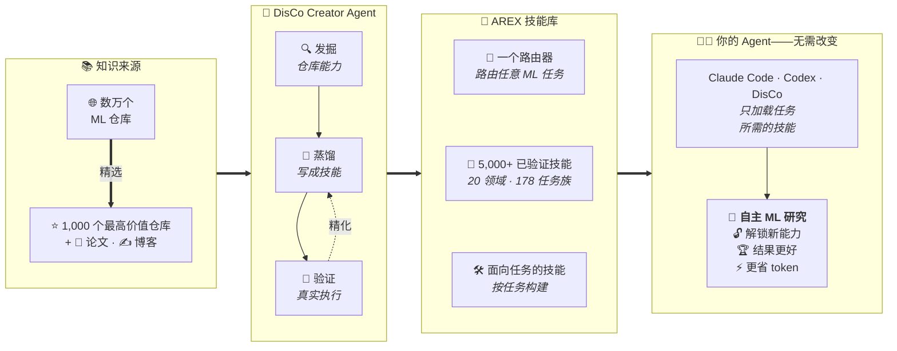
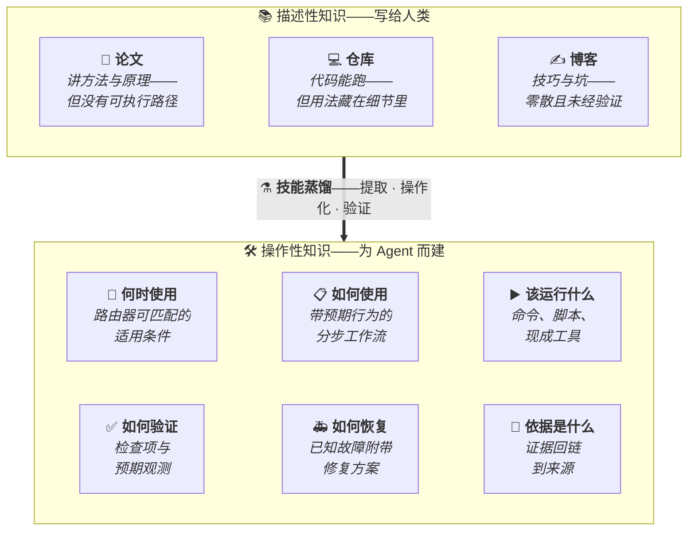
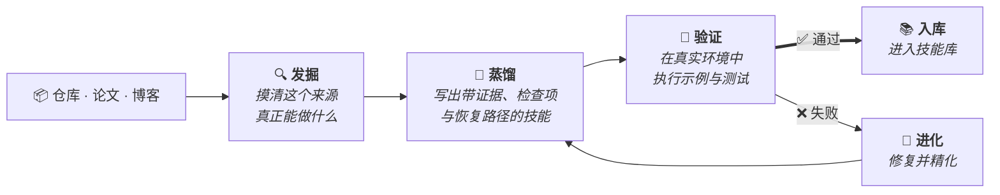
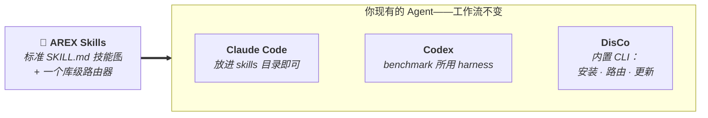

<h1 align="center">AREX-Skill</h1>

<p align="center">
  <strong>把仓库与论文变成自主 ML 研究的技能</strong>
</p>

<p align="center">
  一个开放技能库：从 <b>1,000 个 ML 仓库</b>蒸馏出
  <b>5,000+ 个经过验证、可直接执行的技能</b>——以及构建它们的 agent。
</p>

<p align="center">
  <a href="skills/README.md"></a>
  <a href="skills/repositories/repo-skills/"></a>
  <a href="https://www.npmjs.com/package/@auto-ml-skills/disco"></a>
  <a href="LICENSE"></a>
</p>

<p align="center">
  <a href="README.md">English</a> | <b>简体中文</b>
</p>



> **同一个 Agent，同样的预算，胜率 2.3 倍。**
> MLE-bench 让 Agent 独立完成 75 个 Kaggle 机器学习竞赛。装上 AREX 技能后，
> 原生 Codex 的夺牌比例从 **31% 跃升到 73%**——超过全部公开榜单条目。
> 靠的是技能，不是 agent engineering。

---

## 🧭 目录 <a id="table-of-contents"></a>

- [动态](#news)
- [为什么需要 AREX-Skill](#why-arex-skill)
- [从知识到技能](#from-knowledge-to-skills)
- [AREX Skill 是什么](#what-is-an-arex-skill)
- [AREX-Skill 的构建方式：DisCo](#how-arex-builds-skills)
- [接入你现有的 Coding Agent](#works-with-your-coding-agent)
- [技能库规模](#library-scale)
- [技能一览](#skill-gallery)
- [技能真的能让 Agent 更会做研究吗](#do-skills-make-agents-better-researchers)
- [快速开始](#quick-start)
- [更大的图景](#the-bigger-vision)
- [参与贡献](#contributing)
- [文档](#documentation)
- [致谢](#acknowledgement)
- [许可证](#license)
- [引用](#citation)

---

## 📣 动态 <a id="news"></a>

- **2026-08-27**：技能库扩展到 **1,000 个仓库、5,000+ 技能**，路由器重建后
  覆盖全部仓库。技术报告即将发布，包含 MLE-bench、PaperBench、
  Frontier-CS、PassNet 的完整评测结果。
- **2026-08-03**：AREX-Skill 首发，包含 DisCo 的 Creator / Researcher
  工作流，以及首个 AREX-Skill Library 版本：面向 170 个常用仓库、超过
  1,000 个操作技能。

---

## 💡 为什么需要 AREX-Skill <a id="why-arex-skill"></a>

**研究知识无处不在，但 Agent 仍然用不好它。**

| 📄 **论文** | 💻 **代码仓库** | 🤖 **Agent** |
|:---:|:---:|:---:|
| 解释*为什么*有效 | 包含*能跑通的*实现 | 仍要*每次重新摸索* |

论文、仓库和博客几乎承载了这个领域全部的 know-how——但它们是写给人读的：
松散、异构、没有 Agent 可以直接调用的统一接口。于是每个任务里，Agent 都在
消耗上下文窗口和执行预算去搜索、阅读、试错，重新推导领域早已写下的知识。

我们把这层缺失的东西称为**操作知识（operating knowledge）**：即"知道一个
方法"与"把它跑通"之间的 know-how。AREX-Skill 把它预先编译一次，沉淀为
技能。

---

## 🧠 从知识到技能 <a id="from-knowledge-to-skills"></a>

> **我们不做仓库摘要。我们把仓库编译成 Agent 可以执行的技能。**



产出既不是摘要，也不是 RAG 索引，而是 **Knowledge → Capability**：每个技能
都声明它的适用条件、执行行为、支撑证据、验证步骤和故障处理——Agent 行动、
校验与恢复所需的一切，无需再回到原始来源重新推导。

---

## 🧩 AREX Skill 是什么 <a id="what-is-an-arex-skill"></a>

AREX Skill 是一个自包含、可被 Agent 直接阅读的操作知识单元。它遵循开放的
[Agent Skills](https://github.com/agentskills/agentskills) 格式，以
`SKILL.md` 为核心，并可按需包含配套资源：

```text
AREX Skill
│
├── 🧭 SKILL.md：入口与 Router
│   ├── 适用范围
│   ├── 任务路由
│   ├── 操作工作流
│   └── 验证与故障排查
│
├── 📖 references/：专题指令
│   ├── 安装与配置
│   ├── 详细工作流
│   └── 故障排查与 provenance
│
└── 🛠 scripts/：可执行辅助工具
    ├── 诊断与 smoke test
    ├── 工作流工具
    └── 兼容性与可复用 helper
```

`SKILL.md` 是 skill 的入口，负责说明适用范围、操作指令，并在需要时进行
任务路由。`references/` 和 `scripts/` 是可选的：references 提供专题指导
与 provenance，scripts 则提供用于诊断、工作流和可重复检查的可执行辅助工具。

如果一个仓库覆盖多个工作流，可以将其中的 skills 组织成 repository skill
graph，由 root skill 把任务路由到面向具体能力的 sub-skills：

```text
Repository Skill Graph
│
├── root SKILL.md：入口与 Router
└── sub-skills/
    ├── inference/SKILL.md
    ├── training/SKILL.md
    └── evaluation/SKILL.md
```

每个 sub-skill 本身也是一个独立的 AREX Skill，可以有自己的 references 和
scripts。root 与 sub-skills 之间的链接构成 **skill graph**——这是
AREX-Skill 为支持渐进披露而增加的扩展，使 Agent 只读取任务需要的分支。

---

## ⚗️ AREX-Skill 的构建方式：DisCo <a id="how-arex-builds-skills"></a>

**AREX-Skill Library 通过 DisCo 的“发掘—蒸馏—验证”工作流构建。**



普通的 repo-to-doc 工具止步于 `仓库 → 文档`。DisCo 的 Creator agent 跑的是
完整的实验闭环——基于证据的探索、技能图生成，以及**带精化的验证**：生成的
检查和原生示例会被真正执行，失败会被修复，循环持续到技能图通过检验或预算
耗尽。技能只有通过了自己的测试才会发布。

---

## 🤖 接入你现有的 Coding Agent <a id="works-with-your-coding-agent"></a>

**不需要新 Agent，不需要新工作流。**



技能就是标准的 `SKILL.md` 技能图（agent-skills 格式）。把它们放进你正在用
的 coding agent 即可——没有专有 runtime，也不用迁移到新的研究平台。内置的
[DisCo CLI](cli/) 负责安装、路由和更新，下方的 benchmark 结果用的正是未做
任何修改的 Codex。

---

## 📊 技能库规模 <a id="library-scale"></a>

<table align="center">
  <tr>
    <td align="center"><h2>1,000</h2>广泛使用的<br>ML 仓库</td>
    <td align="center"><h2>5,000+</h2>自主蒸馏并验证的<br>技能</td>
    <td align="center"><h2>20</h2>个研究领域<br>178 个任务族</td>
  </tr>
</table>

<p align="center">知识来源：GitHub · 论文 · 技术博客</p>

这不是一个 demo，而是一个持续增长的**机器学习研究技能库**的第一个规模化
节点——从训练基础设施、LLM 对齐、推理服务，到机器人、基因组学和科学计算。
[技能目录](docs/imported-repo-skills.md)列出了每张技能图的上游仓库、源
commit 和覆盖范围。

---

## 🖼️ 技能一览 <a id="skill-gallery"></a>

技能在实践中长什么样——来源 → 技能 → 一句 prompt：

| | 来源 | 技能 | 对你的 Agent 说 |
|---|---|---|---|
| 🔍 | [FAISS](skills/repositories/repo-skills/faiss/) | 向量检索与索引组合 | *「在 recall ≥ 0.95 的前提下优化这个 FAISS 索引的延迟。」* |
| ⚡ | [vLLM](skills/repositories/repo-skills/vllm/) | 高吞吐 LLM 服务 | *「在这台机器上对比 vLLM 和 SGLang，报告可验证的吞吐量。」* |
| 🧠 | [Unsloth](skills/repositories/repo-skills/unsloth/) | 高效 LLM 微调 | *「在 24 GB 显存内用这份数据微调 Llama。」* |
| 🔥 | [Diffusers](skills/repositories/repo-skills/diffusers/) | 扩散模型训练与推理 | *「为这种风格训练一个 LoRA 并验证输出。」* |
| 🦾 | [LeRobot](skills/repositories/repo-skills/lerobot/) | 机器人学习工作流 | *「在这个操作数据集上训练并评估 ACT 策略。」* |
| 🧬 | [AlphaFold2](skills/repositories/repo-skills/alphafold2/) | 蛋白质结构预测 | *「折叠这些序列并检查置信度指标。」* |

每张技能图遵循同一契约：一个可路由的入口技能、面向真实工作流（数据、训练、
评估、服务、排障）的聚焦子技能，以及 Agent 真正可以运行的验证步骤。

---

## 📈 技能真的能让 Agent 更会做研究吗 <a id="do-skills-make-agents-better-researchers"></a>

我们固定所有变量——**Codex harness、GPT-5.5（xhigh）backbone、相同的执行
预算**——只改变一件事：Agent 是否拥有 AREX 蒸馏的技能。

```text
MLE-bench（75 个 Kaggle 竞赛中的夺牌比例）
  无技能    ███████░░░░░░░░░░░░░░░░  31.1%
  有技能    █████████████████░░░░░░  72.9%   （相对提升 +134%）

PaperBench（复现得分，20 篇论文）
  无技能    ███████░░░░░░░░░░░░░░░░  29.5
  有技能    █████████░░░░░░░░░░░░░░  39.6    （相对提升 +34%）
```

| Benchmark | 指标 | Codex | Codex + AREX-Skill | Δ |
| --- | --- | ---: | ---: | ---: |
| **MLE-bench**（全量 75 任务） | 夺牌比例（Any Medal）% | 31.11 | **72.89** | **+41.78** |
| **PaperBench**（全量 20 篇） | 复现得分 | 29.45 | **39.59** | **+10.14** |
| **Frontier-CS**（Agent Track，188 任务） | Score | 70.63 | **77.14** | **+6.51** |
| **PassNet**（200 样本） | AS Score | 1.343 | **1.531** | **+14.0%** |

来自技术报告（即将发布）的几个要点：

- **超越 agent engineering。** 原生 Codex + 技能超过了 MLE-bench 最强公开
  条目（72.89 vs 64.44）——没有定制 harness，没有修改控制循环，只加了蒸馏
  的操作知识。
- **任务越难，优势越大。** MLE-bench High 难度任务上得分从 13.3% 升到
  62.2%（4.7 倍）；无引导试错代价越高的地方，技能价值越大。
- **是"救回"，不只是"锦上添花"。** 提升最大的恰是无技能 Agent 几乎失败的
  任务（PaperBench `rice`：7.9 → 48.5；Frontier-CS 中低于 50 分的任务平均
  提升 +26.6）。
- **靠效率，不靠堆资源。** 在 Frontier-CS 上，Codex + AREX-Skill 在得分、
  token、步数和工具调用四个维度上 Pareto 优于榜单上的 Claude Code 条目，
  token 用量只有其约 1/3。

### 💡 为什么有效 <a id="why-it-helps"></a>

```text
没有 AREX                       有 AREX
─────────                       ────────
搜索网页                        路由到技能
翻阅仓库                        执行已验证的工作流
猜测方案                        按检查项验证
从零调试                        专注优化目标指标
重试、循环……
```

Benchmark 证明性能*确实*提升；操作模式解释*为什么*提升：Agent 更早进入
解空间的高产出区域，把预算花在真正影响指标的选择上。可以看一个完整的
[Creator session](examples/creator/)（构建 FlagEmbedding 技能图）和
[Researcher session](examples/researcher/)（用 Gymnasium +
Stable-Baselines3 技能完成可审计的 RL 实验）。

---

## 🚀 快速开始 <a id="quick-start"></a>

三步得到一个技能驱动的研究 Agent：

```bash
# 1. 安装 DisCo CLI（Node.js >= 22.19）
npm install -g @auto-ml-skills/disco

# 2. 安装技能库（1,000 个仓库 + 路由器）
disco repo-skills install

# 3. 带着技能做研究
disco -p "使用已安装的技能，在这台机器上对 vLLM 和 SGLang 做基准测试，\
分别报告可验证的吞吐量。"
```

首次运行时用 `/login` 或环境变量配置模型提供商
（`ANTHROPIC_API_KEY`、`OPENAI_API_KEY`、`GEMINI_API_KEY` 等）。

<details>
<summary><b>创建你自己的技能（Creator 模式）</b></summary>

DisCo 的 Creator 模式可以从任意仓库或论文蒸馏新技能图，并在导入前完成验证：

```bash
git clone https://github.com/FlagOpen/FlagEmbedding.git
disco --agent-mode creator -p \
  "/skill:distill-ml-knowledge 为 ./FlagEmbedding 创建并验证一张仓库技能图，\
覆盖 embedding 推理与评测。"
```

Researcher 是默认模式；用 `--agent-mode creator|researcher` 或界面里的
`/creator` · `/researcher` 切换。15 个内置 Creator 元技能、验证门控和维护
工作流见 [DisCo Workflows](docs/disco-workflows.md)。

</details>

<details>
<summary><b>在其他 Agent 中使用技能、管理技能集合、从源码构建</b></summary>

- **其他 Agent**：技能是标准 `SKILL.md` 技能图；Claude Code / Codex 的安装
  方式见 [Meta Skills For Other Agents](docs/meta-skills-for-other-agents.md)。
- **管理**：`disco repo-skills status | update`，路由器开关
  `disco repo-skills router disable|enable`。
- **手动安装**：把 `skills/repositories/repo-skills` 和
  `skills/repositories/repo-skills-router` 复制到
  `~/.disco/agent/skills/repositories/`。
- **源码构建**：clone 后执行 `bash scripts/build-from-source-link.sh`。

完整的[安装指南](docs/installation.md)覆盖提供商配置、更新/备份语义、
路由器行为和所有兜底路径。

</details>

---

## 🌐 更大的图景 <a id="the-bigger-vision"></a>

**从仓库到技能，从技能到自主研究。**

> 今天的研究知识是写给人类的。
> AREX 把它变成 AI 研究者的操作知识。


每个技能只需蒸馏一次，之后的每个 Agent 都能继承。随着技能库增长——更多
仓库、更多论文、更多任务族——每个研究任务的起点都会离零更远一步。我们相信
ML 研究知识不应只以论文和仓库的形式存在，还应被编译为 AI 研究者可以直接
调用的技能。

> **命名说明：** AREX-Skill 是项目名，也是发布的 AREX-Skill Library。
> DisCo 是内置的技能驱动 CLI/runtime：Creator 模式创建技能，Researcher
> 模式使用技能做研究。

---

## 🤝 参与贡献 <a id="contributing"></a>

欢迎三类贡献——新的仓库技能、既有技能的更新，以及 DisCo CLI 的改进。技能
PR 需附带来源信息（模型、源 commit、验证步骤）；完整清单见
[CONTRIBUTING_CN.md](CONTRIBUTING_CN.md)。

## 📚 文档 <a id="documentation"></a>

| 页面 | 说明 |
| --- | --- |
| [安装指南](docs/installation.md) | CLI 与技能集合的完整安装、提供商配置、路由器开关、手动兜底方案。 |
| [DisCo Workflows](docs/disco-workflows.md) | 模式与会话、Researcher 执行、Creator 构建、部署范围。 |
| [AREX-Skill Library](skills/README.md) | 技能库模型、集合布局、安装方式。 |
| [Imported Repo Skills Catalog](docs/imported-repo-skills.md) | 全部已发布技能图及其上游基线。 |
| [Repository Catalog](docs/repository-catalog.md) | 按 area -> family 组织的全部已发布仓库技能清单。 |
| [Architecture](docs/architecture.zh.md) | 仓库分层、路由、创作流水线、部署范围。 |
| [Examples](examples/) | 脱敏的端到端 Creator 与 Researcher 会话。 |
| [Bundled Skills Reference](cli/packages/coding-agent/src/disco/skills/README.md) | Creator 元技能契约与产物布局。 |
| [DisCo CLI README](cli/README.md) | CLI 使用、运行时技能路由、软件包。 |

## 🙏 致谢 <a id="acknowledgement"></a>

DisCo 的 CLI 与 agent runtime 构建于
[earendil-works/pi](https://github.com/earendil-works/pi) 之上。pi 是一个开源
AI agent 工具包，提供统一的 LLM API、agent loop、终端界面和 coding-agent
CLI。

AREX-Skill 同样离不开 GitHub 开源社区。这个库中的仓库技能建立在世界各地
研究者和工程师公开发布的高质量 ML、agent、数据、生物/化学、视觉与基础设施
项目之上。感谢所有让这些工作能够被社区使用并继续构建的人。

## 📄 许可证 <a id="license"></a>

除非文件或组件另有说明，仓库级 AREX-Skill 材料采用 Apache-2.0 许可证。技能
库中发布的每个 skill 都有独立的许可证。使用、复制、修改或再分发某个 skill
前，请查看该 skill 的 `SKILL.md` 中的 `license` metadata 字段；该许可证是该
skill 的权威声明，可能不同于本仓库的 Apache-2.0，并包含额外的条件或限制。
用户应自行审查并遵守所使用的每个 skill 的许可证条款。

[`cli/`](cli/) 下独立发布的 DisCo npm 包采用其自身的
[MIT License](cli/LICENSE)，上游署名见
[`cli/THIRD_PARTY_NOTICES.md`](cli/THIRD_PARTY_NOTICES.md)。

## 📝 引用 <a id="citation"></a>

TBA
