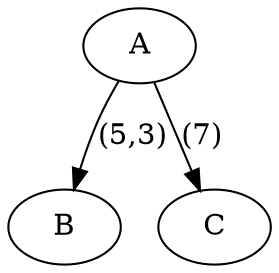

# Temporal Graph And Time-Shift Helpers

DoWhy includes lightweight helpers for temporal causal graphs and lagged feature
creation. Use this reference when the task mentions time lags, temporal graphs,
unrolled graphs, shifted columns, or importing temporal discovery output.

## Core Representation

Temporal edges are ordinary directed NetworkX edges with a `time_lag` attribute:

```python
import networkx as nx

graph = nx.DiGraph()
graph.add_edge("A", "B", time_lag=(1,))
graph.add_edge("B", "C", time_lag=(2, 3))
```

Conventions:

- The edge direction is causal: parent/source -> child/target.
- `time_lag` should be a tuple of integers, even for one lag.
- Multiple rows or entries for the same edge can accumulate multiple lags.
- A lag of `k` means the parent at time `t-k` influences the child at time `t`.
- Helpers are schema transformers; they do not by themselves identify or
  estimate a temporal causal effect.

## Create Temporal Graphs

### From CSV

`dowhy.utils.timeseries.create_graph_from_csv(file_path)` expects columns:

```csv
node1,node2,time_lag
A,B,5
B,C,2
A,C,7
```

Each row represents `node1 -> node2` with the given integer lag. Repeated edges
append time lags to the same edge tuple. Invalid non-integer lags return `None`
after printing a message.

### From DOT

`dowhy.utils.timeseries.create_graph_from_dot_format(file_path)` reads DOT edges
whose `label` contains integer lags:



This path uses NetworkX's `nx_agraph.read_dot`, so it depends on the DOT parsing
backend. If DOT parsing is not available, create a NetworkX graph directly or
convert external output to CSV.

### From External Array Output

`dowhy.utils.timeseries.create_graph_from_networkx_array(array, var_names)`
converts a 3D array shaped `(n_variables, n_variables, n_lags)` into a temporal
`DiGraph`.

Supported link values:

- `"-->"`: edge from `var_names[i]` to `var_names[j]` at lag `t`;
- `"<--"`: edge from `var_names[j]` to `var_names[i]` at lag `t`;
- zeros/empty values: no edge.

Unsupported link values:

- `"o-o"` raises `ValueError`;
- `"x-x"` raises `ValueError`.

Self-loops are skipped in this array helper.

This is the recommended bridge for temporal discovery libraries that output a
lagged adjacency tensor: convert their result to the simple link array, validate,
then pass the resulting DAG or unrolled graph into downstream DoWhy workflows.

## Unroll Lagged Edges

`dowhy.timeseries.temporal_shift.add_lagged_edges(graph, start_node)` performs a
reverse traversal from a target node and creates an unrolled graph with lagged
node names.

Example:

```python
import networkx as nx
from dowhy.timeseries.temporal_shift import add_lagged_edges

graph = nx.DiGraph()
graph.add_edge("A", "B", time_lag=(1,))
graph.add_edge("B", "C", time_lag=(2,))

unrolled = add_lagged_edges(graph, "C")
print(sorted(unrolled.nodes))
# includes: A_-3, B_-2, C_0
```

Node naming convention:

- target at current time: `C_0`;
- lagged parent: `B_-2` for `B` at two steps before target;
- accumulated ancestor lag: `A_-3` if `A -> B` lag 1 and `B -> C` lag 2.

When multiple lagged versions of the same base node exist, the helper also adds
edges between consecutive lagged nodes for that base node.

If no traversed edge has a `time_lag` attribute, the helper returns an empty
`DiGraph`.

## Shift DataFrame Columns

`dowhy.timeseries.temporal_shift.shift_columns_by_lag_using_unrolled_graph(df,
unrolled_graph)` creates a new DataFrame whose columns match lagged graph node
names.

Example:

```python
import pandas as pd
import networkx as nx
from dowhy.timeseries.temporal_shift import shift_columns_by_lag_using_unrolled_graph

df = pd.DataFrame({"A": [1, 2, 3], "B": [10, 20, 30]})
unrolled = nx.DiGraph()
unrolled.add_nodes_from(["A_0", "A_-1", "B_-2"])
shifted = shift_columns_by_lag_using_unrolled_graph(df, unrolled)
```

Behavior:

- A node name must contain a final underscore-delimited integer lag, such as
  `A_0` or `A_-2`.
- The base column name is everything before the final underscore.
- Missing base columns are ignored, so the output may be empty.
- Invalid node names print a warning and are skipped.
- Shifts use pandas `.shift(..., fill_value=0)`, so warm-up rows are zero-filled.

The zero fill is a convenience, not a universal statistical assumption. For real
time-series data, decide whether to drop the first `max_lag` rows or replace zero
fills with a domain-appropriate missing-value policy before downstream modeling.

## End-To-End Temporal Schema Pattern

```python
import networkx as nx
import pandas as pd
from dowhy.timeseries.temporal_shift import add_lagged_edges, shift_columns_by_lag_using_unrolled_graph

raw_graph = nx.DiGraph()
raw_graph.add_edge("marketing", "sales", time_lag=(1, 2))
raw_graph.add_edge("sales", "profit", time_lag=(1,))

target = "profit"
unrolled_graph = add_lagged_edges(raw_graph, target)
shifted_df = shift_columns_by_lag_using_unrolled_graph(raw_df, unrolled_graph)

# Then validate:
assert set(unrolled_graph.nodes).issubset(set(shifted_df.columns))
```

After this point, route based on the actual causal task:

- classic effect estimation over shifted variables -> `../effect-estimation/SKILL.md`;
- GCM modeling over the unrolled graph -> `../graphical-causal-models/SKILL.md`;
- plotting or graph/data debugging -> stay in this sub-skill.

## Boundaries And Cautions

- Temporal helpers do not estimate lagged effects by themselves.
- They do not validate stationarity, autocorrelation, panel structure, or causal
  identification assumptions.
- They do not infer a graph from time-series data; external discovery output must
  be reviewed and converted.
- DOT temporal graph creation requires a DOT parser backend.
- `create_graph_from_csv` and `create_graph_from_dot_format` return `None` on
  invalid lag parsing rather than raising in all cases; check the return value.
- `create_graph_from_networkx_array` asserts the first two dimensions are square
  and raises on unsupported partial/ambiguous link markers.
- Warm-up rows created by shifting are zero-filled and may need removal.
- Node names with underscores are allowed, but the shifted-column helper splits
  on the final underscore. Avoid node names whose final segment already looks
  like an integer lag unless this is intended.

## Validation Checklist

1. Every temporal edge has `time_lag=(...)` with integer values.
2. The graph is directed and acyclic after temporal interpretation or unrolling,
   unless the downstream method explicitly handles cycles.
3. `target_node` is present in the original graph before unrolling.
4. Unrolled node names are interpretable as `base_lag`.
5. Base names exist in the raw DataFrame.
6. Shifted DataFrame columns cover the unrolled graph nodes needed downstream.
7. Warm-up rows are handled explicitly.
8. After shifting, graph nodes and DataFrame columns are revalidated before
   effect estimation or GCM fitting.
